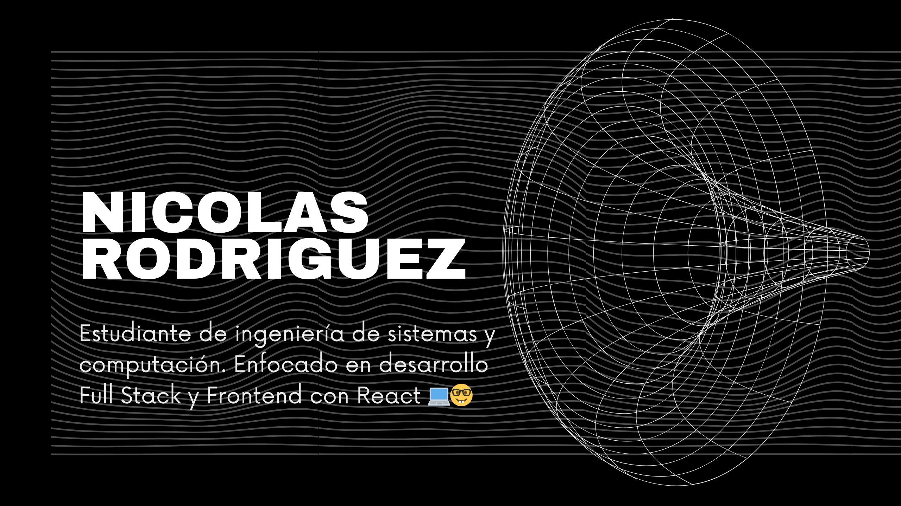

# Bienvenido
# ¡Hola, soy Nicolas Rodriguez ! 👋

### Desarrollador Full Stack en formación | Apasionado por el Frontend y el Backend

---

### 🛠️ Tecnologías y Herramientas:

---

### 🚀 Proyectos Destacados:

- [**Proyecto 1 - Clon Mercado libre**](https://github.com/NISCALOOK/Proyecto-mercado-libre.git)
  - Desarrollado con React.

---

### 🎓 Educación y Certificaciones:

- **Estudiante de ingeniería de Sistemas y computación**, Universidad Nacional de Colombia 
- **Universidad Desarrollo Web - FrontEnd Web Developer!** - Udemy
- **Java Developer Nanodegree** - Coursera

---

### 🧠 Filosofía de Desarrollo:
> “Me encanta resolver problemas y construir soluciones que hagan la vida más fácil. Mi objetivo es seguir aprendiendo y aplicar mis conocimientos en proyectos que generen impacto.”

---

### 🌍 Conecta Conmigo:

